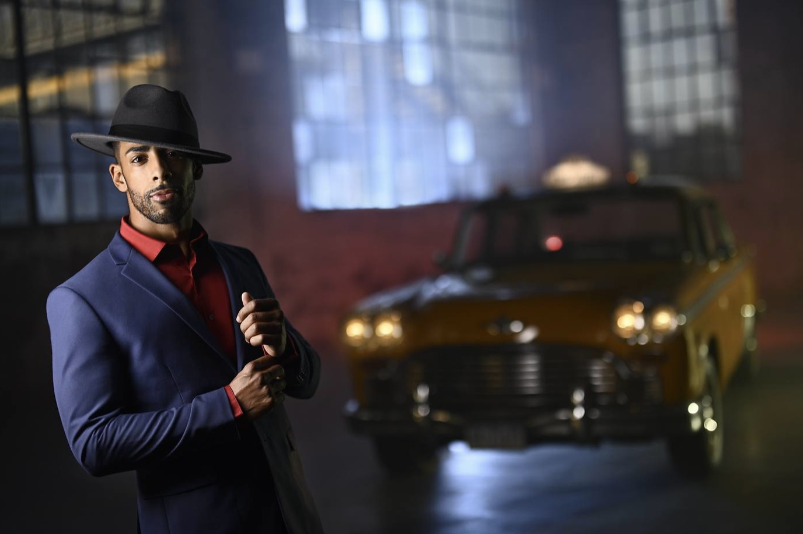

I recently read Joe McNally's book, [The Real Deal: Field Notes from the Life of a Working Photographer](https://www.amazon.com/Real-Deal-Field-Working-Photographer/dp/1681988011/). While I found his anecdotes occasionally interesting, I didn't really enjoy the book. I think this was because I don't much care for McNally's photographs. Here's one of his portraits.



There's no question that McNally is a talented photographer with a powerful work ethic and serious technical skills. His portraits, however, leave me uninspired. You know the style. Creatively lit with a handful of Speedlights, carefully arranged backgrounds or sets, wardrobe and makeup people, etc. The kinds of photos that get a shit ton of likes. This style is not for me.

Now, [Judith Joy Ross](https://en.wikipedia.org/wiki/Judith_Joy_Ross), on the other hand, makes deeply moving, personal portraits while wandering around with an 8x10 view camera. I wasn't familiar with her work until recently. I mean, just look at these...







Simply fantastic work. I just ordered her new book: [Judith Joy Ross: Photographs 1978–2015](https://www.amazon.com/gp/product/1597115223/).

[//]: # "Exported with love from a post written in Org mode"
[//]: # "- https://github.com/kaushalmodi/ox-hugo"
