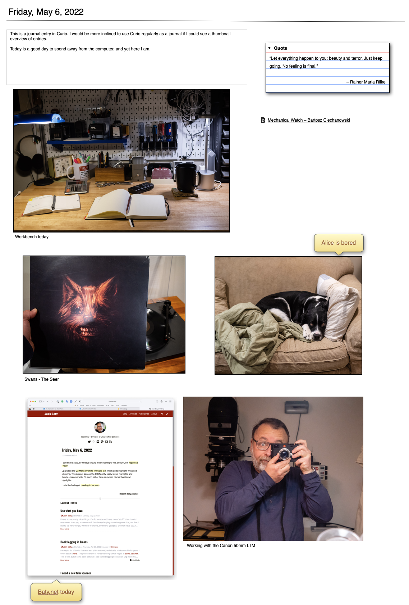

+++
title = "Blogging with Curio"
date = 2022-05-09T10:49:00-04:00
lastmod = 2022-05-09T10:50:03-04:00
slug = "blogging-with-curio"
tags = ["Curio","Blogging"]
categories = ["Software"]
draft = false
weight = 0

+++

I’ve used [Zengobi's Curio](https://www.zengobi.com/curio/) for many years when I needed a visual system for managing projects and associated files. In a recent version, Curio gained a [Journal](https://www.zengobi.com/curio/docs/18/journal/?) feature. It’s fairly rudimentary compared to dedicated journal apps, but I recently started testing it as a way to create a sort of scrapbook each day. It works pretty well for that. I export a PDF of the day’s entry, print it, and put it in a binder.

While farting around with Curio exports, I tried exporting a few entries as HTML and was surprised how much fidelity is maintained when exporting. For giggles, I uploaded a few days’ exports to a web server. I had a crazy idea that this could be a daily blog. [Here is my test site](https://curio.baty.net/2022/).

It’s neat, right? I slap images, notes, cards, mindmaps, lists, _anything_ on the day’s entry, and it ends up as a web page.

While a fun experiment, I don’t think it makes sense long-term, since the resulting web pages are a mess on mobile, offer no accessibility, and managing navigation, etc. is a pain. Still, it’s a neat trick and I may throw pages out there every once in a while, just for fun.

[//]: # "Exported with love from a post written in Org mode"
[//]: # "- https://github.com/kaushalmodi/ox-hugo"
