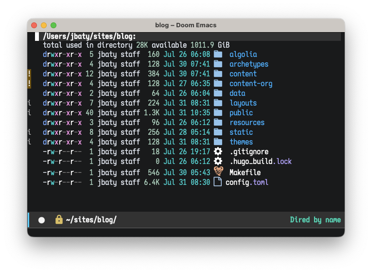
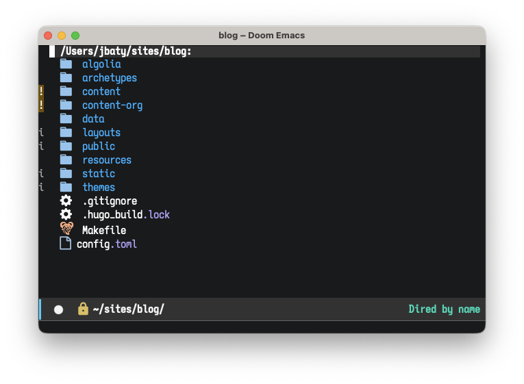

Dired mode in Emacs is fantastic, but one little thing that annoyed me was that the directory listings show file ownership and permissions, taking up space with information I almost never care about. I started down a rabbit hole of figuring out how to hide those columns. I ~~spent~~ wasted an hour on my way to discovering that, of course, there's a built-in way to do it: `dired-hide-details-mode`.

<!--more-->

Well, that was easy.

```lisp
;; Hide file ownership/permissions by default
(add-hook 'dired-mode-hook 'dired-hide-details-mode)
```

This makes the listing go from this...



...to this...



This is almost always what I'd prefer.