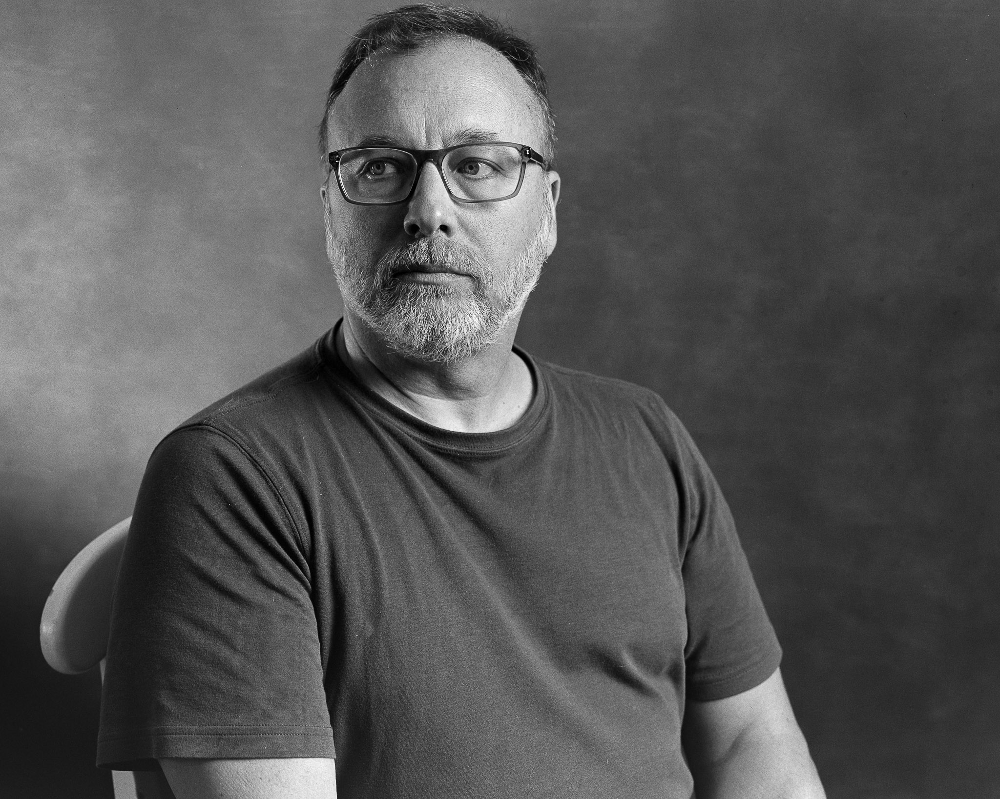
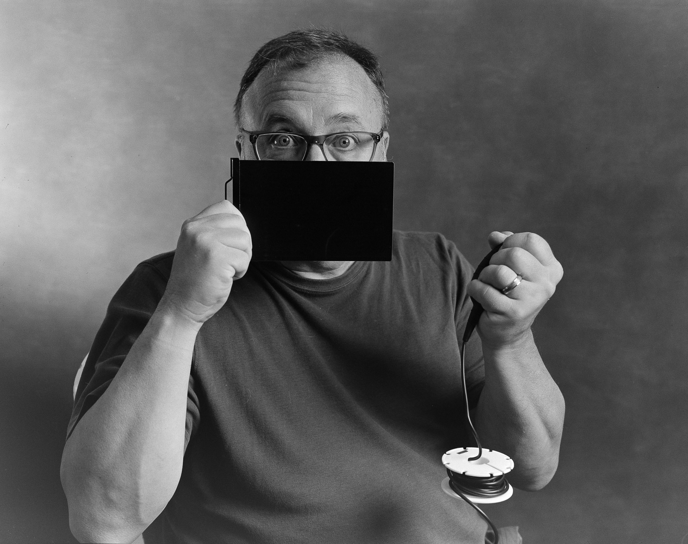
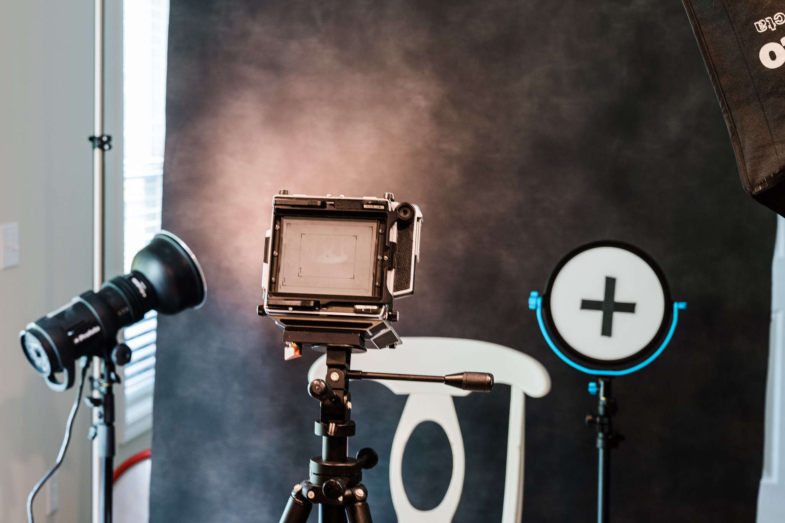

+++
title = "A couple 4x5 self-portraits"
date = 2022-07-28T16:30:00-04:00
lastmod = 2022-07-28T16:49:48-04:00
slug = "a-couple-4x5-self-portraits"
draft = false
weight = 0
+++

I dug out the big Linhof today and made a few self-portraits.

The setup was my usual: painted backdrop with two Profoto strobes, one through a octogon box and one with a small modifier on the background. I mostly wanted to test my new digital camera scanning setup. I think it worked pretty well.

Here's another. I was just horsing around by this point.

This is what the "studio" looked like while setting things up.

